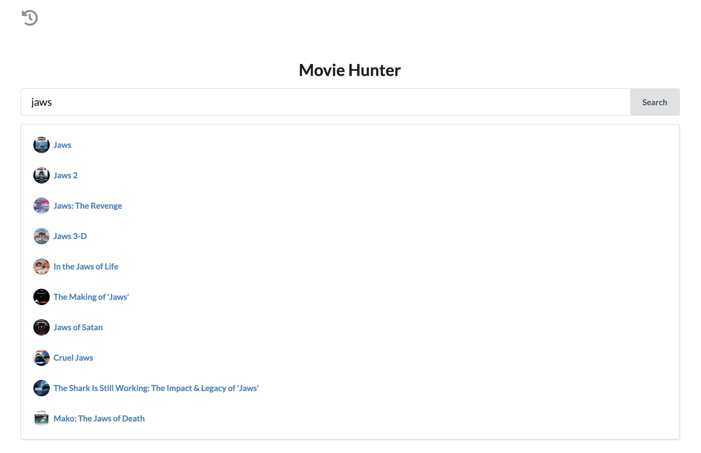
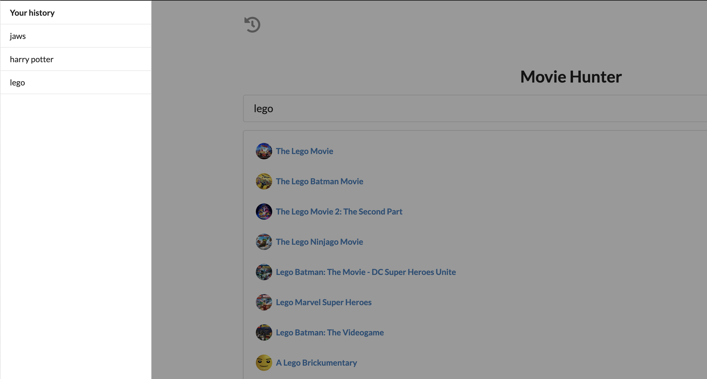

# Simple Movie Searcher with OMDB API, Semantic UI and jQuery

Simple project to experiment using the OMDB API, building out the front-end features with Semantic UI and jQuery.
[Find the demo here](https://chai-ng.github.io/omdb-semantic-ui-jquery/)

## Features
- Be able to retrieve and display results of an API call using AJAX and jQuery
- Use a sidebar component from Semantic UI
- Use a loader to improve UX while user waits for results of the API call
- Be able to store history of a single session

## Backlog
- Each history entry links back to a previous search on a click